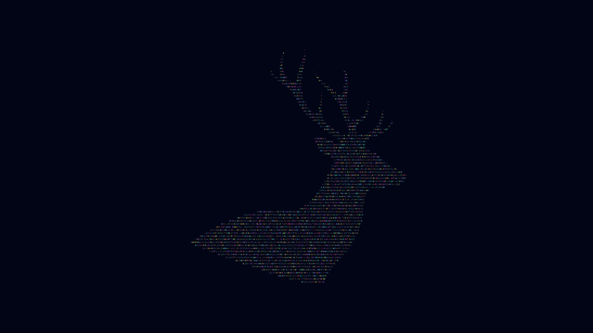

<p align="center">
  
</p>

# Omarchy Dazzle Dusk Theme

An Omarchy theme for dark terminals, neon edges, and late-night velocity. Dazzle Dusk anchors the desktop in black glass, then cuts through it with blue light, hot pink alerts, acid green success, and golden signal.

## Install

```sh
omarchy-theme-install https://github.com/csfh/omarchy-dazzle-dusk-theme
```

You can also install it from the Omarchy menu with `Super + Alt + Space`, then `Install > Style > Theme`, using this repository URL:

```text
https://github.com/csfh/omarchy-dazzle-dusk-theme
```

## Palette

| Role | Hex |
| --- | --- |
| Background | `#121212` |
| Foreground | `#dadada` |
| Accent | `#5fafd7` |
| Red | `#ff5f87` |
| Green | `#5fd75f` |
| Yellow | `#ffd700` |
| Magenta | `#d787ff` |
| Cyan | `#5fd7d7` |

## Included

Desktop, terminal, editor, launcher, notification, bar, lock screen, browser, Discord, and TUI theme files for Omarchy:

`alacritty`, `btop`, `chromium`, `foot`, `ghostty`, `gtk`, `hyprland`, `hyprlock`, `kitty`, `mako`, `neovim`, `swayosd`, `vencord`, `vscode`, `walker`, `warp`, `waybar`, `wofi`, and `zellij`.

## Pairing

Dusk is the dark counterpart to [Dazzle Dawn](https://github.com/csfh/omarchy-dazzle-dawn-theme). Use Dusk when you want the Dazzle color system in a low-light workspace.

## Backgrounds

`omarchy-buck-dark` is the theme stag.

The other wallpapers are photographs on [Unsplash](https://unsplash.com), used under the [Unsplash License](https://unsplash.com/license):

- [`ember-pier`](backgrounds/ember-pier.jpg) by [Anders Jildén](https://unsplash.com/@andersjilden) ([photo](https://unsplash.com/photos/golden-hour-photography-of-docking-pier-on-body-of-water-uwbajDCODj4))
- [`cyan-span`](backgrounds/cyan-span.jpg) by [Alex Knight](https://unsplash.com/@agk42) ([photo](https://unsplash.com/photos/skyline-photography-of-cityscape-Ys-DBJeX0nE))
- [`signal-hall`](backgrounds/signal-hall.webp) by [Martin Martz](https://unsplash.com/@martz90) ([photo](https://unsplash.com/photos/a-group-of-multicolored-lines-on-a-black-background-DI0lpZocxl4))

## License

MIT. See [LICENSE](LICENSE). Copyright (c) 2026 Christoffer Hallas.

Unsplash photographs remain the work of their authors under the Unsplash License.

If you send a pull request or other contribution, you agree to the [CLA](CLA.md).
